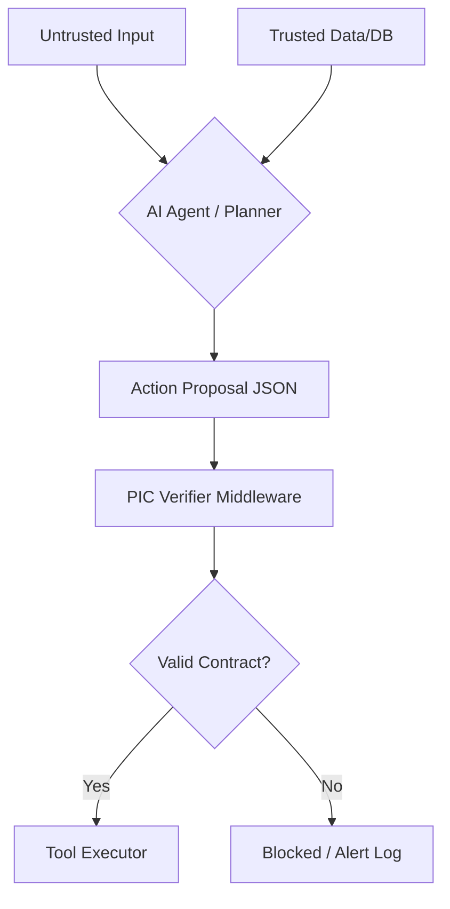

# 🛡️ PIC Standard: Provenance & Intent Contracts
**The Open Protocol for Causal Governance in Agentic AI.**

## 1. The Core Thesis: Closing the "Causal Gap"
Traditional AI safety focuses on **Dialogue Guardrails**. However, enterprise agents operate via **Side Effects** (API calls, financial transfers). 

The **Causal Gap** occurs when an agent performs a high-impact action based on instructions from an untrusted source (e.g., Indirect Prompt Injection). PIC bridges this gap by enforcing a machine-verifiable contract between **Input Provenance** and **Action Impact**.

### 🔍 Comparative Landscape
| Feature | CaMeL | RTBAS | **PIC Standard** |
| :--- | :--- | :--- | :--- |
| **Primary Focus** | Multi-Agent Dialogue | Physical/Robotic Safety | **Business Logic & Side Effects** |
| **Enforcement** | Cognitive/Reasoning | Sensor-based | **Causal Contract (JSON Schema)** |
| **Target Domain** | Research/Chat | Robotics | **SaaS / FinTech / Enterprise** |

---

## 2. Technical Glossary
* **Action Proposal:** A JSON contract generated by the agent *before* tool execution.
* **Causal Taint:** When an untrusted input influences a high-impact output without trusted evidence.
* **Impact Class:** A taxonomy of risk (e.g., `money`, `privacy`, `compute`).
* **Provenance Triplet:** The classification of data sources into `Trusted`, `Semi-Trusted`, or `Untrusted`.

---

## 3. How It Works (The Flow)

## 4. v1.0 Roadmap
- [ ] Phase 1 (MVP): Standardize money and privacy Impact Classes.
- [ ] Phase 2 (SDK): Reference Python/Pydantic implementation.
- [ ] Phase 3 (Integrations): Native middleware for LangGraph and CrewAI.
- [ ] Phase 4 (Advanced): Cryptographic signing for trusted provenance.

## 🤝 Community & Governance
The PIC Standard is an open-source movement. We are actively seeking:

- Security Researchers to stress-test causal logic.
- Framework Authors to build native PIC integrations.
- Enterprise Architects to define domain-specific Impact Classes.

Maintained by [ @fmsalvadori](https://www.linkedin.com/in/fmsalvadori/)
&nbsp;
[ MadeInPluto](https://github.com/madeinplutofabio)
